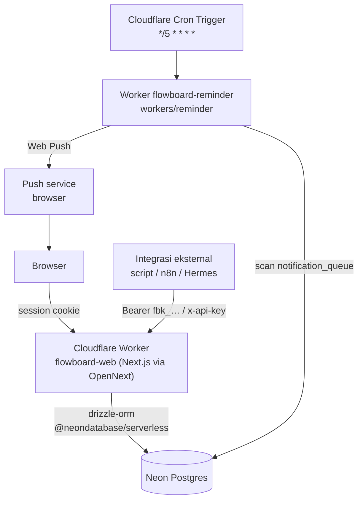

# Architecture

FlowBoard (simple-todo) — papan Kanban + Gantt dengan reminder push. Next.js
App Router yang berjalan di Cloudflare Workers (via OpenNext) dengan database
Neon Postgres. Dokumen ini menjelaskan sistem **sebagaimana adanya**; setiap
klaim di bawah bisa ditelusuri ke berkas di `02-application/`.

## Diagram

Dua Worker terpisah, satu repository:

- **`flowboard-web`** — aplikasi Next.js (UI + REST API sesi + public API v1).
- **`flowboard-reminder`** — Worker terpisah dengan Cron Trigger tiap 5 menit.
  Terpisah karena memakai runtime `workerd` langsung (HTTP driver Neon, Web
  Crypto untuk VAPID), bukan Node adapter OpenNext.

## Komponen

| Komponen | Teknologi | Lokasi |
|---|---|---|
| UI (papan, Gantt, list) | Next.js 15 App Router, React 19, Tailwind 4, `@tanstack/react-query` | `src/app/(app)/`, `src/components/` |
| Drag & drop | `@dnd-kit/core` + `@dnd-kit/sortable` | `src/components/board-view.tsx` |
| Autentikasi sesi | better-auth 1.7, email+password (scrypt) | `src/lib/auth.ts`, `src/app/api/auth/[...all]/route.ts` |
| Public API v1 | Route handler mandiri + API key per user | `src/app/api/v1/`, `src/lib/api-v1.ts` |
| Logika domain | Operasi task/board/status (dipakai sesi dan v1) | `src/lib/domain.ts` |
| Mesin reminder | Perhitungan jadwal murni (tanpa DB), teruji unit | `src/lib/reminders.ts` + `reminders.test.ts` |
| Pengiriman push | Web Push (VAPID) via `@pushforge/builder` | `workers/reminder/index.ts`, `src/lib/push-delivery.ts` |
| Skema database | Drizzle ORM + drizzle-kit (17 tabel) | `src/db/schema.ts`, `drizzle/` |
| Middleware | Redirect sesi + proteksi rute admin | `src/middleware.ts` |
| CI/CD | GitHub Actions → migrate → deploy Cloudflare | `.github/workflows/deploy.yml` |

## Data model

17 tabel di `src/db/schema.ts`. Inti:

- **Auth** (dikelola better-auth): `user`, `session`, `account`, `verification`.
- **Isi papan**: `boards` → `statuses` → `tasks` → `subtasks`; label lewat
  `labels` + `task_labels` (many-to-many).
- **Notifikasi**: `notification_settings` (satu baris per user), `notification_queue`
  (satu baris per task+jenis; kunci unik `(task_id, kind)` membuat penjadwalan
  ulang idempoten), `push_subscriptions` (satu per perangkat).
- **Operasional**: `activity_logs`, `login_attempts` (rate limit login),
  `api_keys` (hanya hash SHA-256), `api_rate_limits`.

Semua entitas milik user lewat `boards.user_id`; kepemilikan diverifikasi di
`getOwnedBoard`/`getOwnedTask` (`src/lib/domain.ts`) sebelum operasi apa pun.
Untuk API v1, objek milik user lain mengembalikan **404, bukan 403**, agar
keberadaannya tidak bocor.

## Alur reminder

1. Setiap perubahan jadwal task (tanggal, jam, status selesai) memanggil
   `rescheduleTaskReminders()` di `src/lib/domain.ts`.
2. `computeReminders()` (`src/lib/reminders.ts`) menghitung empat jenis reminder
   — `start_soon`, `due_soon`, `due_today`, `overdue` — dari tanggal + jam
   deadline, timezone user, quiet hours, dan override per task. Reminder yang
   sudah lewat tidak dijadwalkan.
3. Baris hasilnya masuk `notification_queue` dengan `status='pending'`.
4. Worker `flowboard-reminder` (cron tiap 5 menit) mengambil baris yang jatuh
   tempo, menandai `sending` secara **kondisional** (`UPDATE … WHERE status='pending'`),
   lalu mengirim Web Push ke seluruh perangkat user dan mencatat `sent`/`failed`
   beserta `attempts` dan backoff.

Prioritas nilai reminder: **override per task** (`tasks.remind_lead_minutes`)
→ setelan user (`notification_settings`). `remind_on_start` mengaktifkan
`start_soon`; `reminders_muted` mematikan seluruh reminder task tersebut.

Idempotensi: Cron Trigger Cloudflare bersifat *single-flight*, driver HTTP Neon
tidak mendukung transaksi interaktif, jadi pengamanan duplikat bertumpu pada
transisi status kondisional + kunci unik `(task_id, kind)`.

## Batasan yang perlu diketahui

- **Tidak ada transaksi interaktif** di runtime Worker (`@neondatabase/serverless`
  HTTP). Operasi multi-tabel harus idempoten, bukan mengandalkan rollback.
- **Timezone adalah data user**, bukan konfigurasi server. Zona user
  (`user.timezone`) dipakai untuk semua perhitungan jam — diubah di
  `/settings/profile`.
- **Kredensial production tidak disimpan di repo.** Verifikasi yang butuh sesi
  dijalankan terhadap build produksi lokal dengan database dev.
- `make deploy` sengaja tidak melakukan apa pun (exit ≠ 0) — deploy hanya lewat CI.
